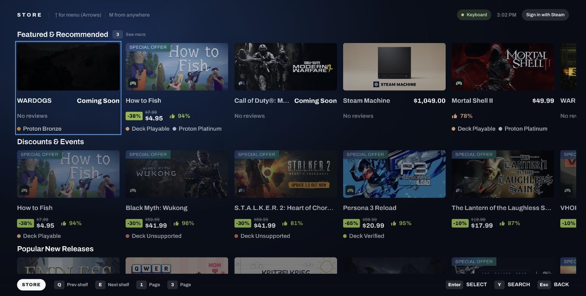

<div align="center">

# Bazzite Store

**A controller-first Steam store for Bazzite Game Mode.**

Big Picture's store tab is the Steam website in a browser — tiny hit targets, hover states that mean
nothing on a dpad, and a layout designed for a mouse three feet closer than a couch.
This replaces it with a real TV interface.

[](https://github.com/claygorman/bazzite-native-store/actions/workflows/ci.yml)
[](https://github.com/claygorman/bazzite-native-store/releases)
[](LICENSE)
[](https://tauri.app)



</div>

---

## What it does

- **Home shelves** — featured, specials, new releases and under-$10, with price, discount, review
  score, controller support and Deck compatibility read straight off each tile
- **Browse by tag** — every Steam tag, grouped, with a live preview of how much of each one actually
  runs on this hardware
- **Search** — an on-screen keyboard a dpad can actually drive
- **Game pages** — trailers that play in place, screenshots, reviews, requirements, DLC
- **A release calendar** — what is coming, day by day, personalised when Steam is running locally
- **Your wishlist and owned badges** — read from the Steam client already signed in on the machine
- **Settings** — scale, safe area, controller feel, glyph set, compatibility filters, cache, and a
  live view of whether Steam is actually answering

Everything is live Steam data. Nothing is mocked.

> [!NOTE]
> **Alpha, and honest about it.** It works end to end, but it has never been run on the television
> it is designed for — every screenshot so far is a desktop browser at 2560×1296, not 4K at ten
> feet. Expect the type sizes to move.

## Install

**On Bazzite or any x86_64 Linux:**

```sh
curl -fsSL https://raw.githubusercontent.com/claygorman/bazzite-native-store/main/scripts/install.sh | bash
```

That fetches the latest AppImage, drops it in `~/.local/bin`, and offers to add it to
Steam as a non-Steam game. No `sudo` — Bazzite is an immutable ostree image, so
everything lands under `$HOME`. Re-run it any time to update.

Piping from `curl` means the script cannot ask you anything — stdin is the script
itself, so there is no terminal left to read an answer from. Pass the choice in:

```sh
curl -fsSL https://raw.githubusercontent.com/claygorman/bazzite-native-store/main/scripts/install.sh \
  | ADD_TO_STEAM=1 bash
```

**Flags** (`--help` prints these too):

|                |                                                                            |
| -------------- | -------------------------------------------------------------------------- |
| `--check`      | Print installed vs latest and exit. `0` = current, `10` = update available |
| `--yes`, `-y`  | No prompts; add the Steam shortcut without asking                          |
| `--help`, `-h` | Print usage and exit                                                       |

**Environment variables:**

|                |                                                                                                                                                  |
| -------------- | ------------------------------------------------------------------------------------------------------------------------------------------------ |
| `ADD_TO_STEAM` | `1` adds the Steam shortcut without asking, `0` skips it silently. Unset means ask — which only works when run interactively, not through a pipe |
| `BIN_DIR`      | Where the AppImage lands. Default `~/.local/bin`. Keep it under `$HOME`, which survives an ostree rebase                                         |
| `REPO`         | The GitHub repo to install from, as `owner/name`. For forks and testing                                                                          |

Prefer to do it by hand? Grab the `.AppImage` from
[Releases](https://github.com/claygorman/bazzite-native-store/releases), drop it in
`~/.local/bin`, and `chmod +x`.

> [!IMPORTANT]
> Point the Steam shortcut at the **`.AppImage` file itself**. The updater replaces the
> file at `$APPIMAGE`, an environment variable only the AppImage runtime sets — run it
> any other way (an `--appimage-extract`'d tree, a wrapper script) and updates download
> and then silently do nothing.

Once installed, it updates itself: **Settings → Updates**.

## macOS and Windows

Steam runs there too, so the store does. Every release publishes:

|             |                                  |
| ----------- | -------------------------------- |
| **Linux**   | `.AppImage` (x86_64)             |
| **macOS**   | `.dmg` — Apple silicon and Intel |
| **Windows** | `-setup.exe` (x86_64)            |

> [!WARNING]
> The macOS and Windows builds are **unsigned**. macOS will refuse to open the app until
> you clear the quarantine flag, and Windows SmartScreen will warn once:
>
> ```sh
> xattr -dr com.apple.quarantine /Applications/bazzite-store.app
> ```
>
> Signing them properly needs an Apple Developer account and a Windows code-signing
> certificate. Until then, build from source if you would rather not do that.

What degrades off Linux, and says so rather than pretending:

|                                  |                                                                                                                                                                                               |
| -------------------------------- | --------------------------------------------------------------------------------------------------------------------------------------------------------------------------------------------- |
| **Owned badges and wishlist**    | Read from the local Steam client's logged-in session over its debug port — which the desktop client has on all three platforms. Where it is unreachable, the Wishlist entry dims and says why |
| **Steam's UI scale**             | Read from Steam's own `config.vdf`, found on all three — but the scale keys only exist on a Game Mode install                                                                                 |
| **Host facts on the About page** | `/proc` and `/etc/os-release` are Linux-only, so CPU/GPU/kernel simply do not render elsewhere                                                                                                |

You do not need Linux to work on it either — `pnpm dev` runs the whole thing in a browser
against live Steam data.

## Updating

**Automatically — on by default.** The app checks on every launch and downloads a new
build in the background, then Settings → Updates offers **Restart**. It never restarts
itself, and it skips the download entirely on a metered connection.

**Manually, in the app.** Settings → Updates → **Check for updates**. That one row is
three actions in sequence: `Check` → `Install` → `Restart`.

**From a shell** — for SSH, `ujust` recipes, or cron, where there is no UI to reach:

```sh
# install or update — the same command either way
curl -fsSL https://raw.githubusercontent.com/claygorman/bazzite-native-store/main/scripts/install.sh | bash

# just ask: exits 0 if current, 10 if an update is available
bash <(curl -fsSL https://raw.githubusercontent.com/claygorman/bazzite-native-store/main/scripts/install.sh) --check
```

The exit code is what makes it scriptable:

```sh
# a `ujust` recipe or a cron entry
bazzite-store-update:
    #!/usr/bin/env bash
    if ! bash <(curl -fsSL .../install.sh) --check; then
        bash <(curl -fsSL .../install.sh) --yes
    fi
```

Turn automatic updates off in Settings → Updates if you would rather drive it yourself.

## Development

```sh
pnpm install
pnpm dev          # browser, live Steam data through a proxy — no Linux needed
pnpm tauri:dev    # the real desktop app (Linux)
```

```sh
pnpm typecheck && pnpm test && pnpm build
cargo test --manifest-path src-tauri/Cargo.toml
```

The browser build is a faithful preview — same components, same data, and a gamepad works through
the browser Gamepad API. Only the desktop-only paths differ.

## How it works

**Tauri v2 + React + TypeScript + Tailwind v4.** A ~10 MB binary instead of a bundled browser, on a
distro whose whole point is leaving RAM for the game.

Three rules the code does not break:

|                                           |                                                                                                                                                                                         |
| ----------------------------------------- | --------------------------------------------------------------------------------------------------------------------------------------------------------------------------------------- |
| **Never reimplement purchase**            | Buying deep-links to Steam (`steam://store/<appid>`). An architectural line, not a shortcut                                                                                             |
| **Never scrape the website**              | JSON endpoints exist for everything the UI needs                                                                                                                                        |
| **Never claim what the data cannot back** | Several Steam endpoints answer `200` with empty arrays rather than an error, so every reader tells "no data" apart from "we could not ask", and degrades instead of blanking the screen |

Two decisions that look odd until they don't:

- **The gamepad is read in Rust via `gilrs`**, not the browser Gamepad API — Tauri renders with
  WebKitGTK on Linux, whose Gamepad API is unreliable, and input is the one thing this app cannot
  get wrong.
- **HTTP lives in Rust too**, to dodge CORS and cache to disk. Steam rate-limits to roughly 200
  requests per five minutes, so caching is a correctness requirement rather than an optimisation.

## Docs

|                                                |                                                            |
| ---------------------------------------------- | ---------------------------------------------------------- |
| [`docs/ARCHITECTURE.md`](docs/ARCHITECTURE.md) | Why Tauri, why not a Decky plugin, why not Electron        |
| [`docs/SETTINGS.md`](docs/SETTINGS.md)         | What counts as a setting, and what got cut from the design |
| [`docs/DESIGN-PORT.md`](docs/DESIGN-PORT.md)   | Where the design spec is converted rather than copied      |
| [`docs/DEMO-HOSTING.md`](docs/DEMO-HOSTING.md) | The web demo server                                        |

Some comments cite `private/…` documents — Steam endpoint catalogs and notes naming specific
hardware. Those are deliberately unpublished; every fact the code depends on is restated at its call
site.

## Releasing

`semantic-release` on `main`, triggered manually from **Actions → Release**. Conventional Commits
drive the version: `feat:` is a minor, `fix:` a patch. The project is held below `1.0.0` on purpose,
so a `BREAKING CHANGE:` footer also maps to a minor.

The release then fans out over four runners — Linux, Apple silicon, Intel Mac, Windows —
each signing its own bundle and writing one fragment of the update manifest. A final job
merges the fragments into the `latest.json` that installed clients poll. Linux is the
shipping target, so a manifest missing it fails the release; the other three are built
with `fail-fast: false` and may legitimately be absent.

## AI disclosure

Built collaboratively with **Claude Code** (Anthropic). The design comes from Claude Design; the
implementation, the endpoint verification and the unusually dense comments were produced in that
collaboration and reviewed by a human. Treat the comments as the reasoning record they are — where
one says a thing was measured on a given date, it was.

## Licence

[MIT](LICENSE). Not affiliated with or endorsed by Valve. "Steam" and "Steam Deck" are trademarks of
Valve Corporation; this client talks to Steam's public storefront endpoints and hands every purchase
back to Steam itself.
